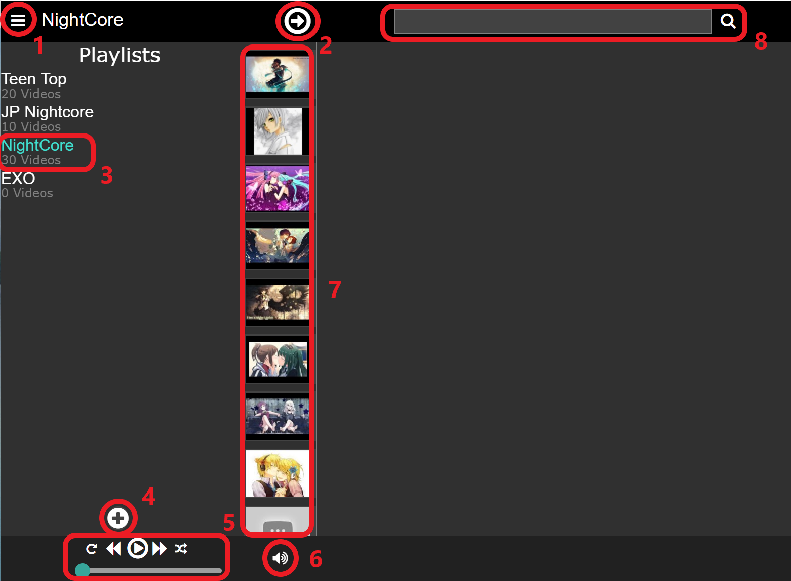
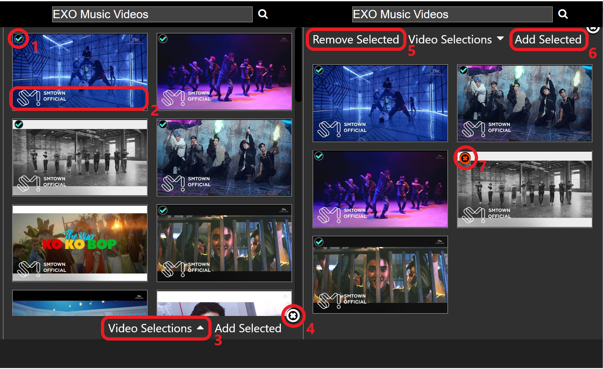

Play Youtube videos in the comfort of your extensions bar

# Table of Contents
1. [Getting Started](#getting-started) 
2. [Playlists](#playlists)
3. [Search](#searching)
4. [Restricted Videos](#restricted-videos)
5. [Troubleshooting](#troubleshooting)

# Getting Started

  

1. Toggle this button once to show your list of playlists on the left and
    toggle it again to minimize the list.
2. Toggle this button to minimize the search screen(right) and toggle it again
    to display it. 
3. This is your playlist. Click on it to display the videos in it as shown in
    #7. 
4. Toggle this button to bring up a screen to add playlists. Toggle it again to 
    minimze the screen. 
5. This is the control panel for video playing. From left to right, the buttons are:
    1. Repeat. If toggled, the playlist will repeat once it ends
    2. Rewind. If clicked, the previous video in the playlist will be played
    3. Play/Pause. If clicked, the video will be played/paused
    4. Fast Forward. If clicked, the next video in the playlist will be played 
    5. Shuffle. If toggled, the playlist will be shuffled when played
    The bar on the bottom displays the amount of time that has elapsed in the video.
6. This is the volume control. Click it to change the volume for the extension.
7. This is the display for the videos in your playlist. Click #1 to maximize the view.
8. This is the search bar. Enter some keywords and press the search button/enter to 
     search for videos on Youtube to add to your playlist.

# Playlists

##  Creating Playlists
To create a playlist, click on #7 in the [Getting Started](#getting-started) section.
Here you will have two choices:
1. Create an empty playlist

    If you choose this option, you will be asked to provide a name for the playlist and a
    playlist with that name will be created once you click "add".

2. Import a playlist from Youtube.

    Here you can either import a public Youtube playlist or your own private Youtube playlist.
    If you choose to import your private playlist, you will have to sign in with your Google account.

##  Adding Videos

To add videos to your playlist, see the [Searching](#searching) section or select a playlist 
and hover over its name on the top and click the + button. 

##  Editing Playlists

There are two ways to edit the title of a playlist:
  1. Toggle #1 in [Getting Started](#getting-started) and hover over the playlist you want to 
    edit and click the pen button.
  2. Select the playlist you want to edit and hover over its title on the top and click the 
    pen button.

You can also edit the videos in the playlist by selecting the playlist, hover over the video
you want to edit, and selecting the pen button.

##  Deleting Playlists

You can delete a playlist by hovering over the playlist you want to delete and clicking the
trashcan button. You will be asked to confirm that you want to delete the playlist.

# Searching

  

When you search for something, the results will be displayed below in a list format
1. Click on a video to select it (green checkmark) and click it again to deselect it.
2. Hover over a video to display its title
3. Click here to see all the videos that you have selected (screen on right)
4. Click here to clear your search results
5. The "remove selected" button will remove all videos with a red x from your video selections.
6. The "add selected" button allows you to add all the videos with a green checkmark to an existing
   or new playlist.
7. On the video selections screen only, click a video once (red x) if you want to remove it with 
   the "remove selected" button, and click the video again if you decide not to.

# Restricted Videos

A restricted video is a video that a channel/company does not allow to be played
outside of Youtube or if the video is not available in your region.

If a video in your playlist is a restricted one and you try to play it,
a notification will pop up on the right telling you that it's restricted and 
give you the option to delete the video from your playlist and the next video 
in the playlist will be automatically played.

# Troubleshooting

If you find a bug, feel free to email me a description of the bug and how
you triggered it and put "Muse.K bug" as the subject: rycintech@gmail.com 
