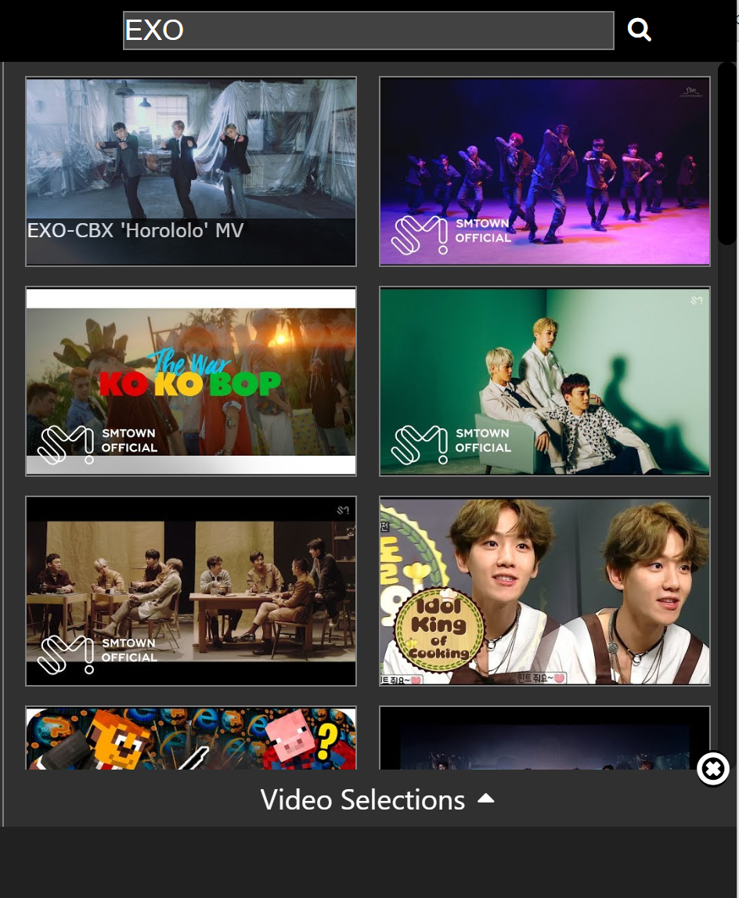
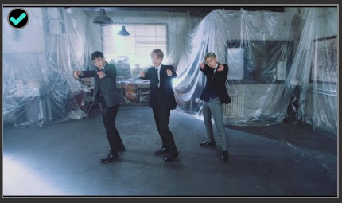
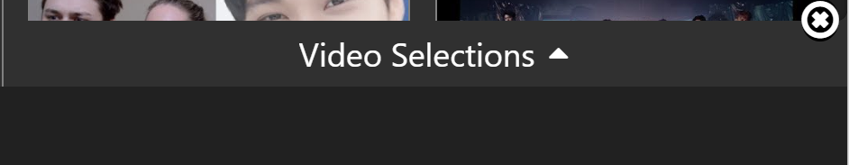
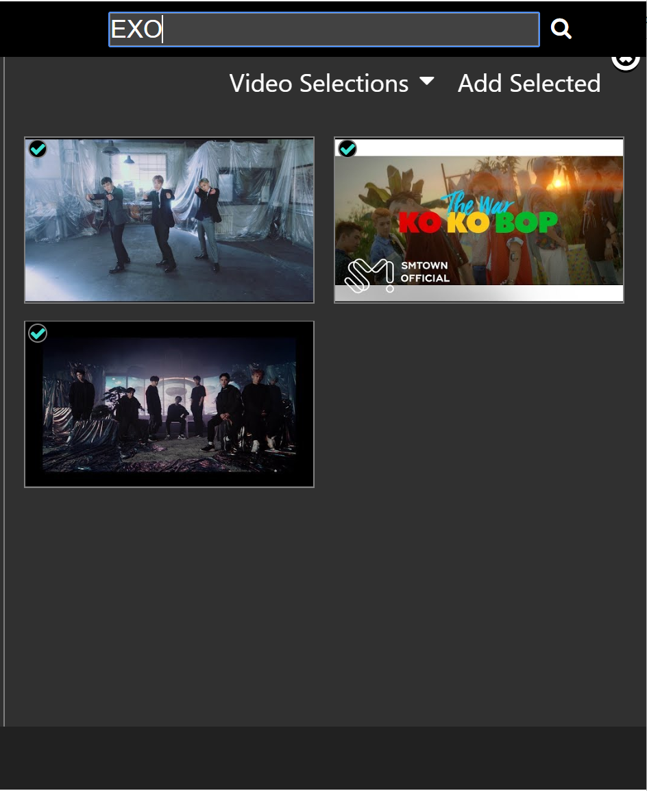
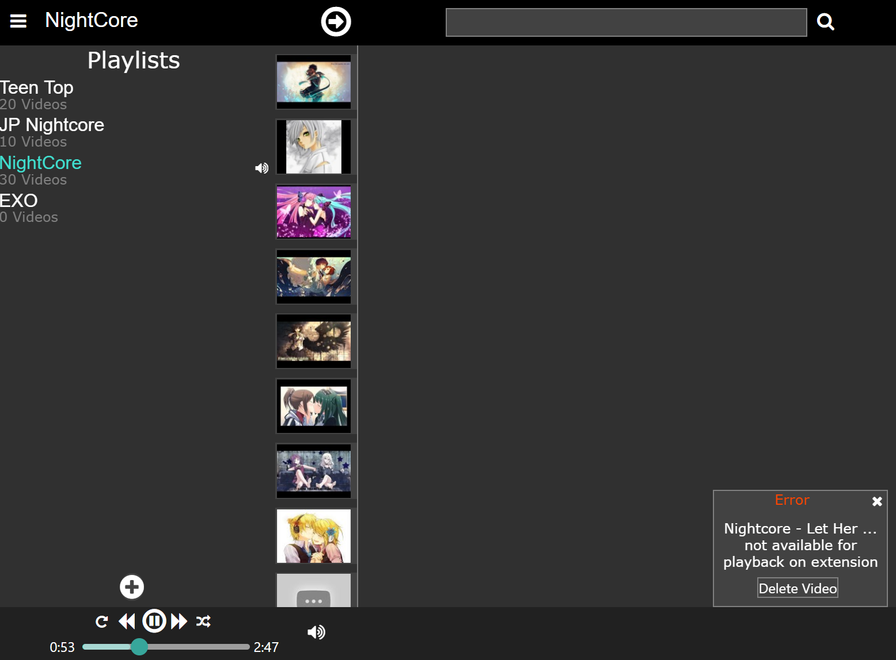

## 
Play Youtube videos in the comfort of your extensions bar

# Table of Contents
1. [Getting Started](#getting-started) 
2. [Playlists](#playlists)
3. [Search](#searching)
4. [Restricted Videos](#restricted-videos)
5. [Troubleshooting](#troubleshooting)

# Getting Started

  Coming soon

# Playlists

  Coming soon

# Searching

  Locate the search bar on the top right and enter whatever you'd 
  like to search for. Then press "enter" on your keyboard or
  the search button to the right of the board.

  The search results will appear below the search bar. 
  
  Hover over any video to display the title.

         
     

  Click on any video to select it and click it again to deselect it.
  
  Selected videos are indicted by the green green arrows on the top
  left corner.

     

  Your selected videos will appear in the video selections screen.  
  Click the bar to bring it up.

 

  All the videos you have selected will appear on this screen.    
  You can remove videos from this selection by clicking on a video (the video will
  then be marked by a red x) and then clicking the "remove selected" button
  on the top left.  
  You can also add videos by clicking the "add selected" button and selecting
  a playlist to put the videos in.  
  Click "video selections" again to minimize the screen.  
  You can also clear your search by clicking the poorly placed white x.

    
   
  

# Restricted Videos

  A restricted video is a video that a channel/company does not allow to be played
  outside of Youtube or if the video is not available in your region.

  If a video in your playlist is a restricted one and you try to play it,
  a notification will pop up on the right telling you that it's restricted and 
     give you the option to delete the video from your playlist and the next video 
     in the playlist will be automatically played.

      
# Troubleshooting

  If you find a bug, feel free to email me a description of the bug and how
  you triggered it and put "Muse.K bug" as the subject: rycintech@gmail.com 

